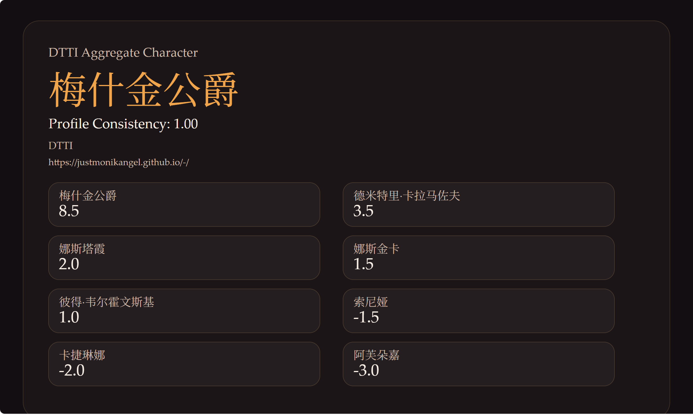
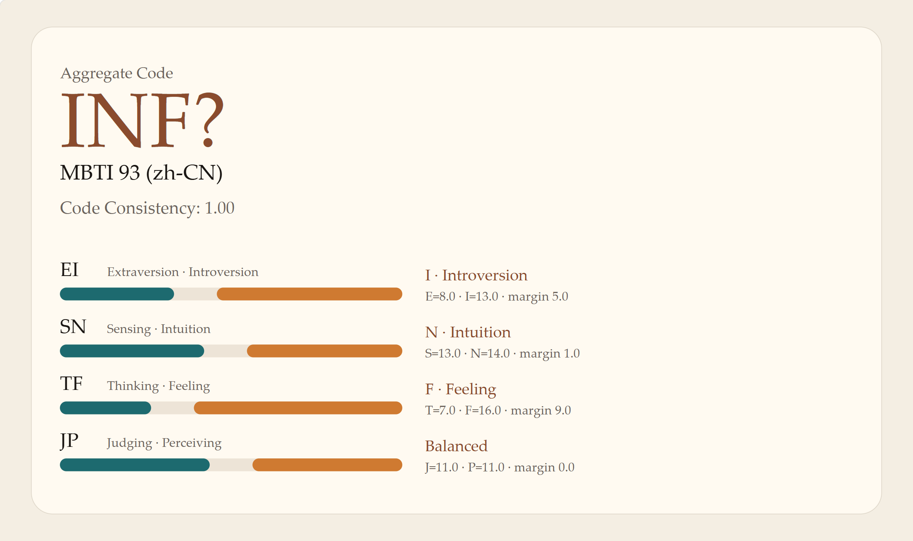

# AgentTypeTest

[Simplified Chinese README](./README.zh-CN.md)

> Run the test. Reveal the type.

SBTI is having a moment, MBTI never really went away, and people keep making AI roleplay all kinds of personalities.

But have you ever wondered what personality your own lobster or coding assistant would get?

That is why I built this skill: it lets your AI take a personality-style test by itself.

You can hand this GitHub repo to your AI, let it run the test, and get back a personality card.

AgentTypeTest keeps the question banks, staged delivery, result aggregation, and report rendering in one workflow so you can run different agents side by side and compare them.

## Project Snapshot

- Blind and staged test delivery
- Local banks and website-backed adapters
- Repeatable multi-round runs
- Visual reports in `html` and `svg`
- Packet-level artifacts for inspection and replay

## Supported Sources

- Local banks: `mbti93-cn`, `mini-ipip-en`
- Website adapters: `16personalities`, `sbti-bilibili`, `dtti`
- Transports: `manual`, `subprocess`, `openai-compatible`

## Example Outputs

These screenshots came from real GPT-5.4 runs against the current adapters and local banks.

<table>
  <tr>
    <td width="50%">
      
       
      <strong>16Personalities</strong> 
      ENFP-T · Campaigner · full browser flow · 60 / 60 AI-answered
    </td>
    <td width="50%">
      
       
      <strong>SBTI Bilibili</strong> 
      LOVE-R（多情者） · avg match 73.0% · 31 / 31 AI-answered
    </td>
  </tr>
  <tr>
    <td width="50%">
      
       
      <strong>DTTI</strong> 
      梅什金公爵 · profile consistency 1.00 · local scoring from extracted site data
    </td>
    <td width="50%">
      
       
      <strong>MBTI 93 (zh-CN)</strong> 
      INF? · code consistency 1.00 · full local bank run
    </td>
  </tr>
</table>

## For Agents

If you want to use this skill, go to the skill folder instead of treating this README as the runtime contract.

Start here:

- [`skills/agent-type-test/SKILL.md`](./skills/agent-type-test/SKILL.md)

## License

This repository is released under [GPL-3.0](./LICENSE).

Bundled test sources can have their own provenance or reuse constraints. Check:

- [skills/agent-type-test/references/built-in-sources.md](./skills/agent-type-test/references/built-in-sources.md)
